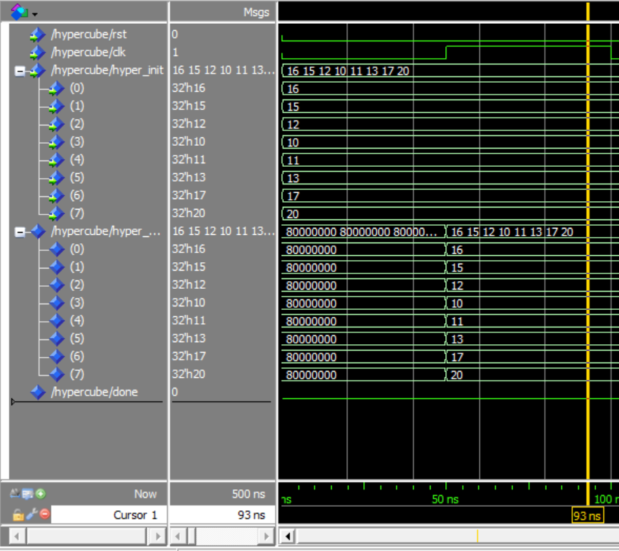
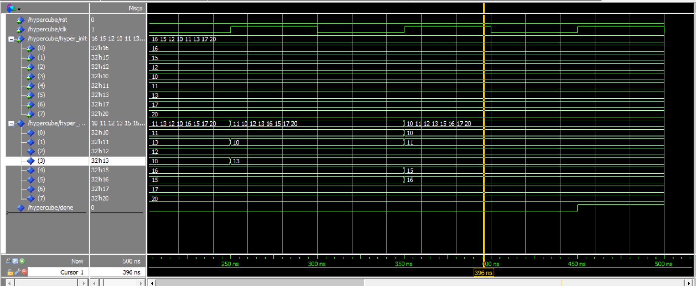
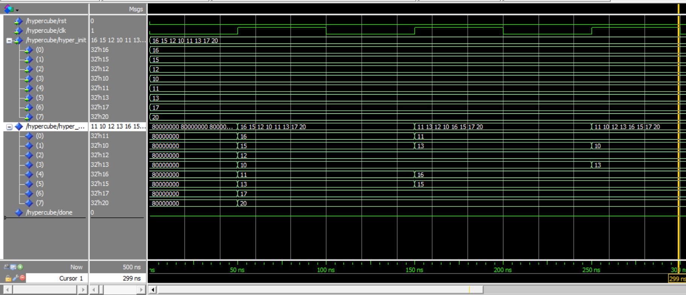
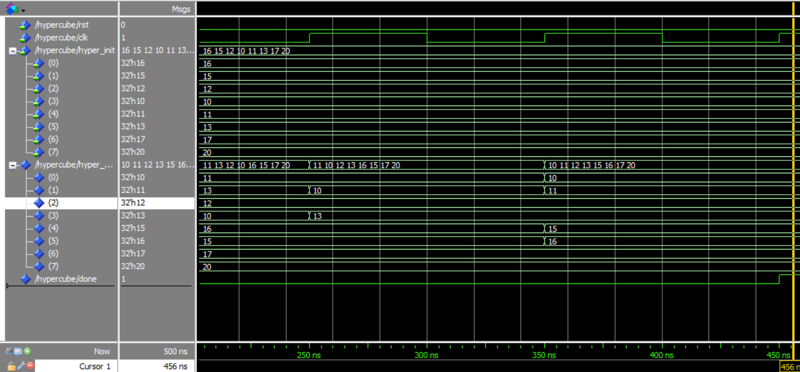

# VHDL Implementation of Bitonic Sequence Sorter on 3-Cube

## Overview

This project showcases the implementation of a Bitonic Sequence sorter on a 3-Cube using VHDL. Bitonic sequences are sequences of numbers that exhibit a pattern of either rising and then falling or falling and then rising. The implementation leverages the concept of a hypercube to efficiently sort data in a parallel computing environment.

### Preliminaries

In an n-cube, every point is connected to n points that differ in one bit, making it an ideal structure for parallel processing. For instance, in a 3-Cube, the point 000 is connected to 001, 010, and 100. Neighbors of each point in n dimensions can be found by XORing the address of the point with 2^i, where i represents each dimension.

### Implementation with VHDL

The VHDL implementation begins by defining an integer array of size 8. A logarithm function is also defined to calculate log(n). The sorting of the Bitonic Sequence is performed in a hypercube, where each node compares its data with its neighbor in the desired dimension and replaces it if necessary. The number of dimensions is equal to the logarithm of the number of data elements.

The provided image illustrates the algorithm presented for sorting Bitonic Sequences. Each processor or node in the hypercube compares its data with the desired next neighbor in log(n) iterations and replaces it if needed. The variables 'y,' 'x,' and 'index' play a crucial role in this process.

### Results

The project's results are visualized through a series of images, showcasing the state of the final array at different clock cycles. The first clock cycle initializes the array, and subsequent cycles perform sorting operations in different dimensions until the 'done' signal becomes equal to 1.

